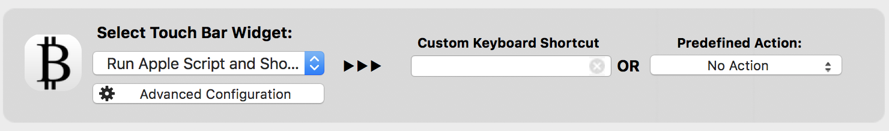

# Cryptotool

Crypto coins on your Mac tool bar.

## Wait, another one?

Well, yeah. But I wanted one that adapted to my workflow and I was bored. The goodies:

* Prices in USD.
* Prices in EUR.
* 24h % changes.
* Switch between different parameters every few seconds.
* Paint it red if the % change is negative.
* Lots of coins.
* Doesn't take too long to get data.

## Installation

This requires [BetterTouchTool](https://www.boastr.net/) to work.

Assuming you have it installed:

1. Click [here](https://github.com/fribmendes/cryptotool/releases/tag/v0.1.0) to download.
2. Open BTT.
3. Go to TouchBar.
4. Manage Presets > Import.
5. Choose whatever coins you want to track by selecting the files in the `widgets` directory.
6. Open Terminal.app and run: `mkdir ~/.cache && mv /path/to/download/cryptotool ~/.cache/cryptotool`

It should now be available if you press Option + Ctrl + Shift (I just like to hide it away in a corner so it doesn't distract me at all times).

## Coins

By default:

* BTC
* ETH
* LTC
* XMR
* NEO
* OMG
* XRP
* MIOTA
* EOS

But any coin can be added, by anyone! Either [open an issue](https://github.com/fribmendes/cryptotool) and I'll do it for you or [add it yourself](#moar-coins)!

## Pretty icons

By default you won't get any icons. But I have included a set of icons in the `img` directory just for you :heart:

To use them, open BTT, select the script and simply drag the corresponding icon into the icon area like this:

## Moar coins

Oh good, you want more coins! Yay!

If you really feel I should add them, feel free to [open an issue](https://github.com/fribmendes/cryptotool/issues).

But it should be pretty easy for you to do it yourself:

1. Create a new widget on BTT.
2. Select "Run Apple Script and Show Return Value".
3. Select an existing widget (let's say BTC) and click "Advanced Configuration".
4. Copy the script on the large textbox and close the window.
5. Select your newly created script.
6. Click "Advanced Configuration".
7. Give it a cool name.
8. Paste the script into the textbox.
9. Change the second line coin name from `bitcoin` to whatever it is you like (let's say `dash`)
10. Change the "execute this script every x seconds" value to 3.
11. Click save.
12. Voilá! It should work.

If you want, you can copy the remaining settings from the other widgets.

The alternate color should be `#F81D1D` and the regex `-\d+.\d+`

The coin IDs are provided by [CoinMarketCap](https://coinmarketcap.com/api/).

## Caching

I didn't enjoy the idea of having it check for real time data because that's slow. So I added in a caching mechanism. By default it caches results for 10 minutes. If you would like to change this value, open the `coinmarketcap` file and change the `CACHE_BUST` variable to whatever it is you'd like. This value is in seconds.

## I want more goodies

Great!

First up, feel free to [open an issue](https://github.com/fribmendes/cryptotool/issues). If you want to do it yourself, it's easy by just changing the `coinmarketcap` script.

Let's say you want the hourly change percentage instead of the daily one. Open the `coinmarketcap` and change the `percent_change_24h` regex to `percent_change_1h`.

The `coinmarketcap` script parses the JSON response from CoinMarketCap and returns relevant values separated by `:`. You can just append more values by updating the `parse_json` call and the corresponding widget AppleScript.
